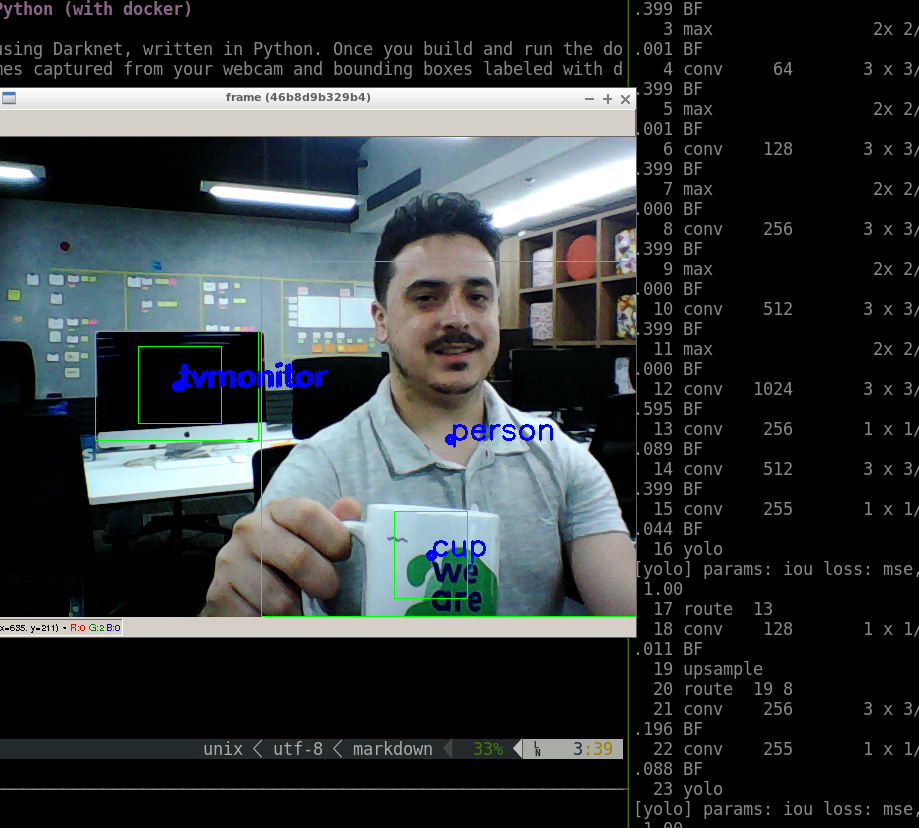

# Darknet object detection example from webcam in Python (with docker)

This project contains an object detection example using Darknet, written in Python. Once you build and run the docker image in Dockerfile a video is shown with frames captured from your webcam and bounding boxes labeled with detections' class.

## How to run this

 - Clone project
 - Build docker image `docker build -t roj4s/darknet_example`
 - Run container and webcam application `docker run -v /tmp/.X11-unix/:/tmp/.X11-unix/ --device /dev/video0:/dev/video0 --gpus all -it roj4s/darknet_example`
